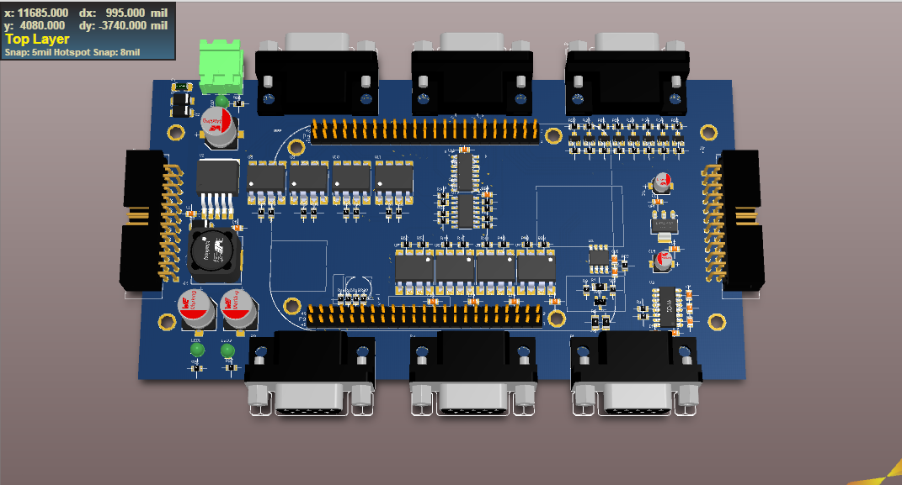
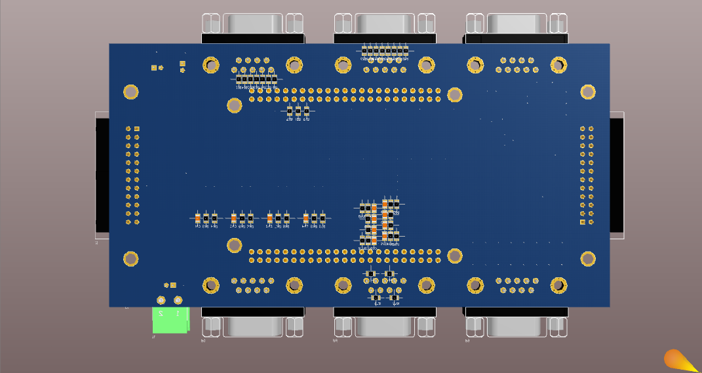
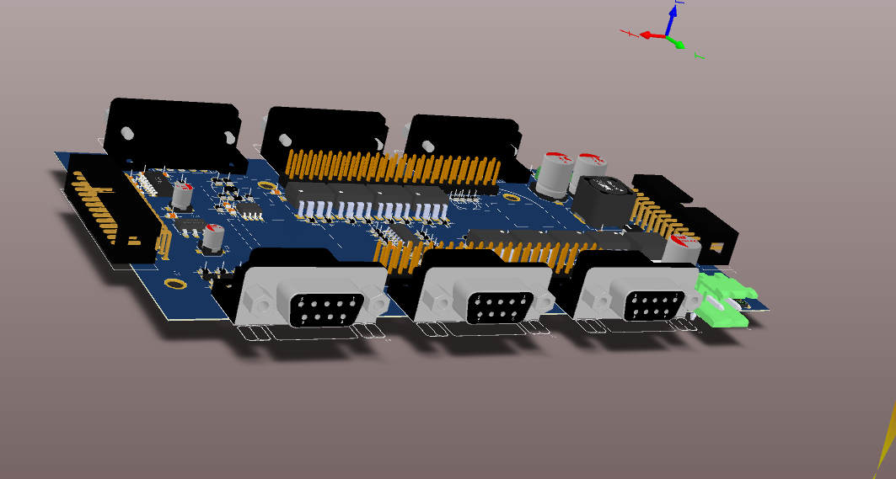
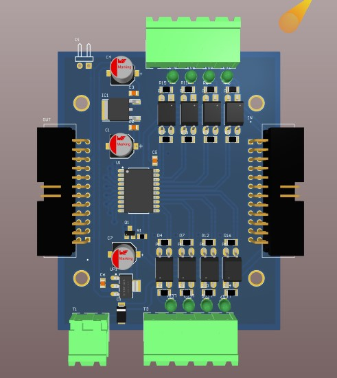
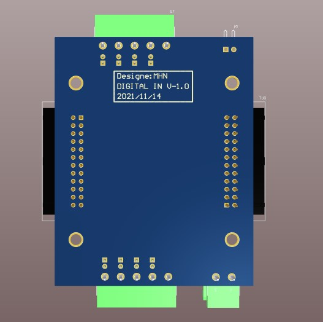
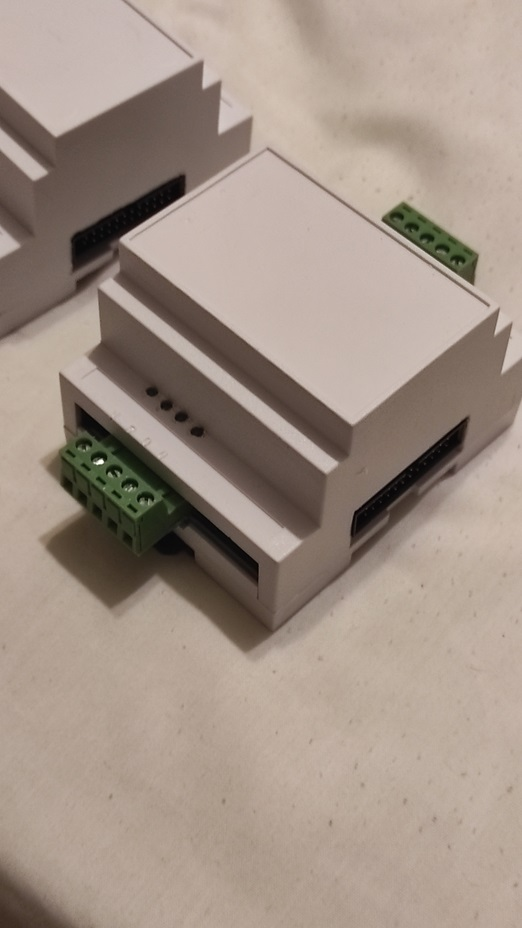
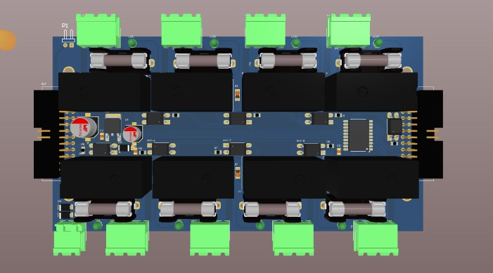
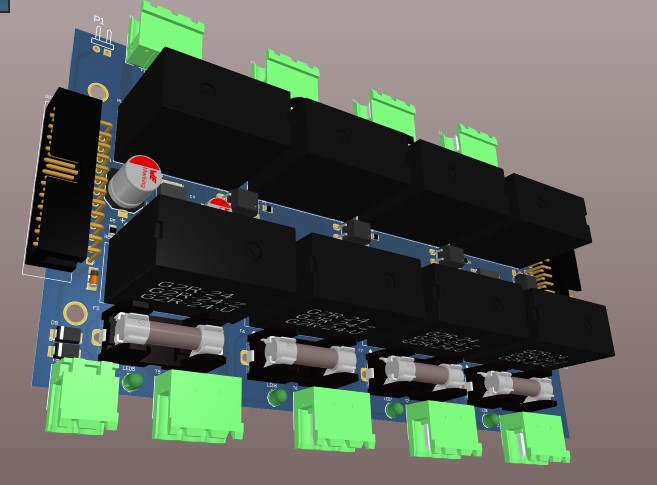
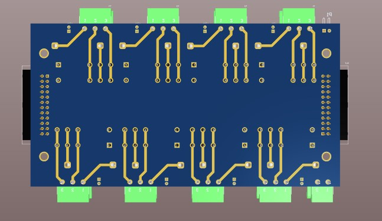

# BeagleBone PLC Extension

This project focuses on transforming a BeagleBone Black into a Programmable Logic Controller (PLC) capable system. It includes PCB designs for Digital Input (DI), Digital Output (DO), and a Main Carrier board, along with simulation files.

## Project Structure

The repository is organized as follows:

- **PCB Design** (`PCB/`)
    - **Main/**: Contains the Altium Designer project files for the main carrier board that interfaces with the BeagleBone Black headers (P8/P9).
    - **DI/**: Design files for the Digital Input module.
    - **DO/**: Design files for the Digital Output module.

- **Simulation** (`DIO Simulate/`)
    - Contains Proteus simulation files (`.pdsprj`) to simulate the Digital I/O behavior before hardware implementation.

## Key Features

- **Modular Design**: Separate modules for Inputs and Outputs allowing for scalable IO.
- **BeagleBone Integration**: Designed to mount directly or interface via ribbon cables to the BeagleBone P8 and P9 headers.
- **Industrial Readiness**: Aimed at providing robust IO suitable for industrial control applications.

## Usage

1. **Hardware**: Start by reviewing the `PCB/Main` schematics. The manufacturing files (Gerbers) can be generated from the `.PcbDoc` files using Altium Designer.
2. **Simulation**: Open `DIO Simulate/DIO.pdsprj` in Proteus Design Suite to view and run the logic simulation.
3. **Reference**: Consult the pinout images in `Ignore/Doc/` when programming the IO pins on the BeagleBone.

## Gallery

### Main Carrier Board

### Digital Input Module

### Digital Output Module

